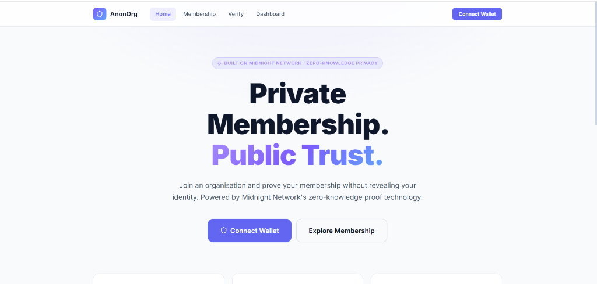
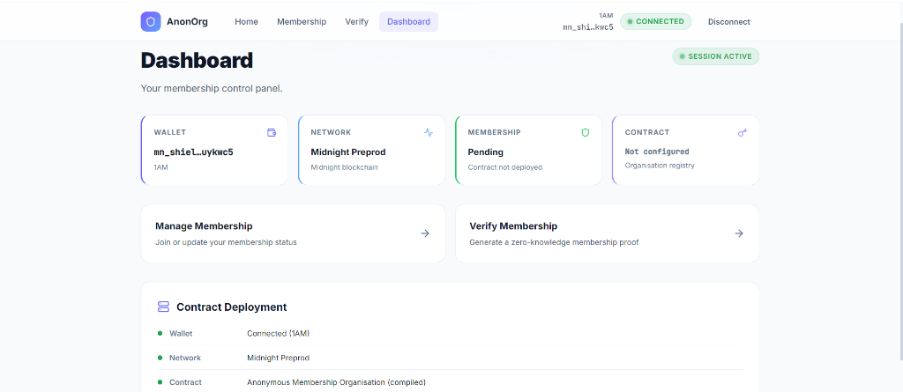
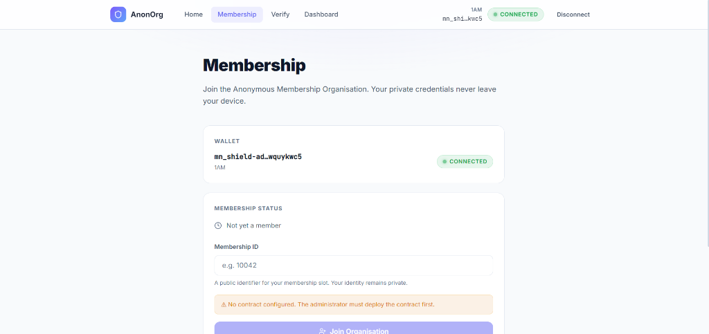

# 🛡️ Anonymous Organization Membership

[](https://midnight.network/)
[](https://docs.midnight.network/)
[](https://github.com/majumdarjishu/Anonymous-organization-membership-NextJs/actions)
[](https://opensource.org/licenses/MIT)

Enterprise Zero-Knowledge Organization Membership & Verification built natively on the Midnight Network using Compact smart contracts, client-side ZK-SNARK proving, dual-state ledger privacy, and Next.js.

## 🔗 Links

[](https://www.youtube.com/watch?v=D4IRcmAV-2Q)
[](https://anonymous-organization-membership-n.vercel.app/)
[](https://github.com/majumdarjishu/Anonymous-organization-membership-NextJs)
[](https://explorer.preprod.midnight.network/transactions/c340a2b0427dc519342ee344a54b23651420413b35142442635d9eab9aae610d)

**Deployed Contract Address (Preprod):** `c340a2b0427dc519342ee344a54b23651420413b35142442635d9eab9aae610d`

## 📸 Application Screenshots

| Screen | Description |
|--------|-------------|
| **Overview & Landing Page**<br> | Hero section showcasing mathematical privacy, connected Midnight wallet, live Preprod network badge, and interactive membership exploration. |
| **Operations & Dashboard**<br> | Real-time membership control panel, wallet connection status, live Preprod blockchain state, and membership status monitoring. |
| **Membership Check-In**<br> | Private witness execution, client-side secret evaluation, and organization registration portal. |

## 🧠 Executive Summary & Problem Statement

### The Problem
Traditional organization membership systems suffer from critical privacy flaws:
- **Raw PII Exposure**: Members are forced to present personal identifiers (names, emails, physical IDs) to prove they belong to an organization, creating massive identity leakage.
- **On-Chain Surveillance**: In standard blockchain access dApps, signing a transaction permanently links a public wallet address to physical memberships and timestamps on an immutable public ledger.
- **Data Breach Vulnerabilities**: Centralized member databases represent lucrative honeypots for credential harvesting.

### The Solution
Anonymous Organization Membership enables members to mathematically prove their organizational authorization in Zero-Knowledge.
- No passcodes or credentials ever leave the member's local device.
- No wallet identities or personal identifiable information (PII) are published on-chain.
- The Midnight ledger verifies the cryptographic proof, increments the aggregate verification counter, and records a one-way commitment hash.

## ⚙️ Working Principles & Cryptographic Flow

The platform leverages Midnight's dual-state architecture where private witness execution is strictly isolated on the client side, and only succinct ZK-SNARK proofs cross the network boundary:

```text
┌─────────────────────────────────────────────────────────────────────────────┐
│ MEMBER'S LOCAL CLIENT                                                       │
│                                                                             │
│      [ Raw Credential ] + [ Membership ID ]                                 │
│                                                                             │
│          ▼ (Private witness execution strictly inside browser/WASM)         │
│                                                                             │
│ ┌──────────────────────────────────────────────┐                            │
│ │ Midnight Compact Circuit                     │                            │
│ │ - credential() witness execution             │  ← Midnight Proof Server   │
│ │ - verifyMembership() constraint evaluation   │    (localhost:6300)        │
│ └──────────────────────┬───────────────────────┘                            │
│                        │                                                    │
│                        ▼ (ZK-SNARK Proof only)                              │
└─────────────────────────┼───────────────────────────────────────────────────┘
                          ▼ (Network Boundary: ZERO PII Transmitted)
┌─────────────────────────────────────────────────────────────────────────────┐
│ MIDNIGHT PREPROD LEDGER                                                     │
│                                                                             │
│ PUBLIC ON-CHAIN STATE:                                                      │
│ ✅ verificationCount — Aggregate counter incremented (+1)                   │
│ ✅ memberCommitments — One-way cryptographic fingerprints                   │
│ ✅ verifiedMembers — Tracked to prevent double-spending/duplicate proofs    │
│                                                                             │
│ PROTECTED PRIVATE STATE (Never exposed or stored on-chain):                 │
│ ❌ rawCredential — Plaintext secret string                                  │
│ ❌ memberIdentity — Name, email, or personal details                        │
│ ❌ memberWalletId — Personal wallet address                                 │
└─────────────────────────────────────────────────────────────────────────────┘
```

### 🛡️ Midnight Privacy Model Breakdown

| Parameter | Visibility | Storage Location | Cryptographic Guarantee |
|-----------|------------|------------------|-------------------------|
| **Raw Credential** | 🔒 Private | Client RAM only | Never serialized over network; evaluated in ZK witness |
| **Membership ID** | 🔒 Private | Ephemeral | Used locally, never revealed on the public ledger |
| **Member Identity** | 🔒 Private | Off-Chain | Zero wallet-to-organization correlation on public ledger |
| **Verification Counter** | 🌐 Public | Midnight Ledger | Aggregate counter tracking verified members |
| **Commitment Hash** | 🌐 Public | Midnight Ledger | One-way cryptographic fingerprint |
| **Admin Key** | 🌐 Public | Midnight Ledger | Active organization admin identifier |

## 📖 Step-by-Step Developer & Operator Guide

### 1. System Requirements & Prerequisites
- **Node.js**: v22.x (LTS recommended)
- **Docker**: For running the local Midnight Proof Server
- **Browser Extension**: [1AM Wallet](https://1am.xyz/) or [Midnight Lace](https://midnight.network/get-lace)
- **Midnight Compiler**: `@midnight-ntwrk/compact-compiler`

### 2. Installation & Setup
```bash
# Clone repository
git clone https://github.com/majumdarjishu/Anonymous-organization-membership-NextJs.git
cd Anonymous-organization-membership-NextJs

# Install root dependencies
npm install

# Install UI dependencies
cd ui
npm install
```

### 3. Start the Midnight Proof Server
Run the containerized Midnight Prover locally:
```bash
docker run -d --name vvp-proof-server -p 6300:6300 midnightnetwork/proof-server
```

### 4. Fund Testnet Wallet
Get testnet tDUST / tNIGHT tokens from the official Faucet:
- **Faucet URL**: [https://midnight-tmnight-preprod.nethermind.dev/](https://midnight-tmnight-preprod.nethermind.dev/)
- **Required**: `tDUST` to pay transaction fees. Convert `tNIGHT` to `tDUST` in your wallet extension.

### 5. Launch the Web Application
```bash
cd ui
npm run dev
```
Open [http://localhost:3000](http://localhost:3000/).

### 6. Connect Wallet (1AM Wallet & Lace)
- Click the "Connect Wallet" button in the top navigation bar.
- The platform automatically scans `window.midnight` using the official `@midnight-ntwrk/dapp-connector-api` specification.
- Select your detected wallet (1AM Wallet or Midnight Lace) and approve the authorization prompt.

### 7. Deploying Contracts to Midnight Preprod
Deployment is intentionally skipped in the repo. You must deploy the contract manually using your wallet seed or via the frontend deployment UI.
```bash
NODE_OPTIONS="--max-old-space-size=12288" npm run deploy -- --network preprod
```
*(Alternatively, run `npm run dev` in the `ui/` folder and navigate to `http://localhost:3000/admin/deploy` to deploy it easily through your browser wallet).*

Once deployed, create a `.env.local` inside the `ui/` folder:
```env
NEXT_PUBLIC_MIDNIGHT_NETWORK=preprod
NEXT_PUBLIC_CONTRACT_ADDRESS=<YOUR_DEPLOYED_CONTRACT_ADDRESS>
```

## ✅ Feature & Compliance Checklist

**Smart Contracts & ZK Circuits**
- [x] Written in Midnight Compact Language (`contracts/anonymous-membership-organisation.compact`)
- [x] Private witness computation for membership credentials
- [x] Public state transitions for aggregate counters and commitment fingerprints
- [x] Zero PII exposure on public ledger state

**DApp & Wallet Connector**
- [x] Built with Next.js App Router and native TypeScript
- [x] Full compliance with official `@midnight-ntwrk/dapp-connector-api` v4 spec
- [x] Native support for 1AM Wallet and Midnight Lace via DApp connector
- [x] Fallback mechanisms for legacy API connections
- [x] Premium Enterprise UI built with Tailwind CSS and Framer Motion

## 🏛️ Real-World Sector Use Cases

| Sector | Practical Application |
|--------|-----------------------|
| **Corporate Facilities** | Employee, contractor, and guest admission without logging identities in central databases. |
| **Government & Defense** | Clearance-level access verification with mathematically guaranteed zero surveillance trail. |
| **VIP Events & Arenas** | Ticket and credential verification without correlating physical attendance to personal public wallets. |
| **Healthcare & Biotech** | HIPAA and GDPR-compliant laboratory access gates where identity exposure violates patient confidentiality. |

## 🛠️ Monorepo Structure

```text
anonymous-membership-organisation/
├── contracts/               # Compact ZK smart contracts
│   └── anonymous-membership-organisation.compact
├── src/                     # CLI and deployment scripts
│   ├── cli.ts               # Interactive CLI for admin tasks
│   ├── deploy.ts            # Deployment script
│   └── setup.ts             # Account setup script
├── ui/                      # Next.js Web Application
│   ├── src/app/             # App Router pages
│   ├── src/components/      # Reusable UI components
│   ├── src/context/         # Global AppContext & wallet lifecycle state
│   └── src/lib/             # ZK utilities and Midnight provider logic
├── test/                    # Contract unit and integration tests
├── docker-compose.yml       # Local devnet infrastructure
└── README.md                # Primary documentation & user guide
```

## 📄 License
This project is open-source and distributed under the MIT License.
