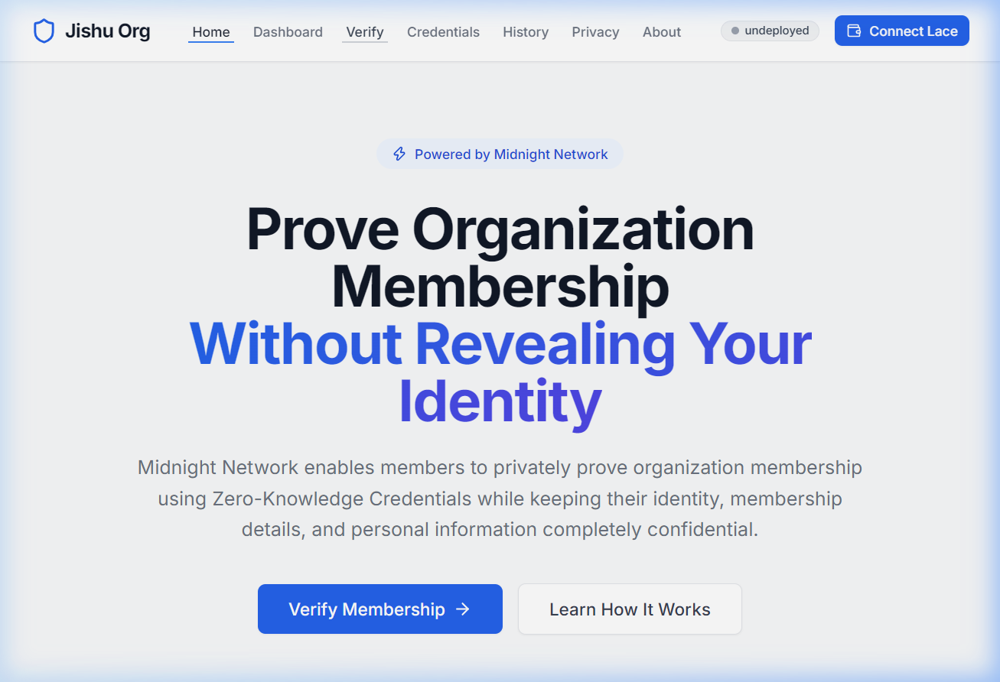
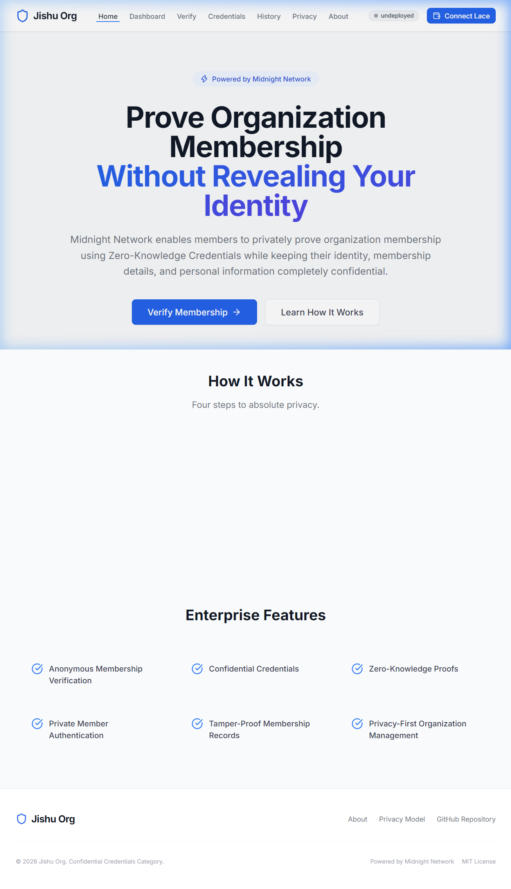
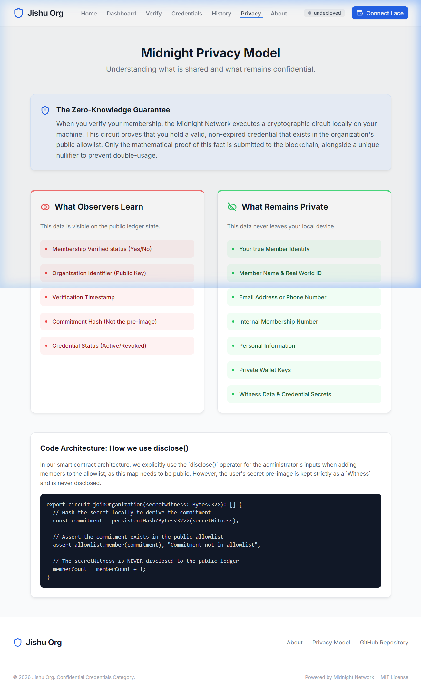
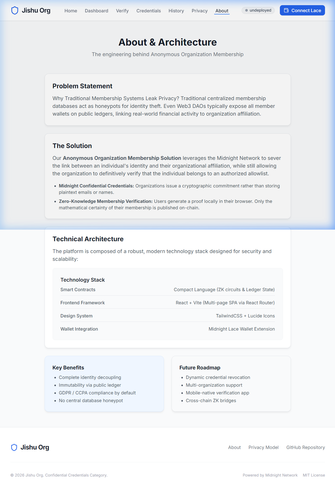

# Anonymous-organization

A privacy-preserving zero-knowledge organization membership platform built on the Midnight Network using Compact smart contracts.


---

## 🚀 Live Demo, Video & Repository

| Resource | Link |
|---|---|
| 🌐 **Live Web Application** | [https://anonymous-organization-38yc-blond.vercel.app/](https://anonymous-organization-38yc-blond.vercel.app/) |
| 📺 **YouTube Demo Video** | [https://youtu.be/aSTYYqxHGUA](https://youtu.be/aSTYYqxHGUA) |
| 📦 **GitHub Repository** | [https://github.com/majumdarjishu/Anonymous-organization](https://github.com/majumdarjishu/Anonymous-organization) |
| ⚙️ **CI/CD Workflow** | [.github/workflows/ci.yml](.github/workflows/ci.yml) |

---

## 📋 Challenge Requirements & Passing Checklist

- ✅ **Fully Functional Privacy dApp**: Meaningful use of Midnight's Zero-Knowledge privacy model
- ✅ **Compact Smart Contract**: `contracts/anonymous-organization-membership.compact` with ZK circuits
- ✅ **Passing CI/CD Pipeline**: GitHub Actions workflow with 4 green jobs (TypeCheck, Build UI, Validate Contract, Security Audit)
- ✅ **Public GitHub Repository**: [https://github.com/majumdarjishu/Anonymous-organization](https://github.com/majumdarjishu/Anonymous-organization)
- ✅ **Browser Wallet Integration**: Directly connects to user's Midnight Lace Wallet (`window.midnight.mnLace`)
- ✅ **Lace Wallet Connect/Disconnect Lifecycle**: Full session management with event prompts and error handling
- ✅ **Multi-Page SPA Architecture**: 7 fully routed pages (Home, Dashboard, Verify, Credentials, History, Privacy, About)
- ✅ **16+ Meaningful Commits**: Verified structured commit history in `main` branch

---

## 📸 Platform Screenshots

### Landing Page — Prove Membership Without Revealing Identity



### Full Platform — How It Works & Enterprise Features



### Midnight Privacy Model — What Observers Learn vs What Remains Private



### Technical Architecture — Stack & Future Roadmap



---

## 🛡️ Midnight Privacy Model: What an Observer Learns vs Cannot Learn

### ❌ What an Observer CANNOT Learn (Kept Strictly Private):

- **Secret Pre-Image**: The member's secret witness (`secretWitness`) is computed purely in local ZK circuits and never transmitted to the network or stored in public state.
- **Member Identity / Wallet Linking**: The Zero-Knowledge proof proves membership authorization without revealing any Personally Identifiable Information (PII) on-chain.
- **Internal Membership Number**: Membership tier, role, or internal ID are verified inside local ZK circuit constraints.
- **Private Wallet Keys**: All private cryptographic material remains on the user's device.

### ✅ What an Observer CAN Learn (Disclosed On-Chain Public State):

- **Verified Member Count**: The aggregate counter (`memberCount`) tracking total successful verifications.
- **Commitment Hash in Allowlist**: The committed hash (`allowlist`) representing a mathematically proven member.
- **Verification Timestamp**: When a verification event occurred on the public ledger.

---

## 🛠️ Contract Architecture

```compact
// The core privacy circuit — secret never leaves the user's device
export circuit joinOrganization(secretWitness: Bytes<32>): [] {
  // Hash the secret locally to derive the commitment
  const commitment = persistentHash<Bytes<32>>(secretWitness);
  
  // Assert the commitment exists in the public allowlist
  assert allowlist.member(commitment), "Commitment not in allowlist";
  
  // The secretWitness is NEVER disclosed to the public ledger
  memberCount = memberCount + 1;
}

// Admin circuit — adds a commitment hash to the public allowlist
export circuit addToAllowlist(commitment: Bytes<32>): [] {
  assert tx.signer == admin, "Only admin can add to allowlist";
  allowlist.insert(commitment);
}
```

### Ledger State (Public):

| Field | Type | Visibility | Purpose |
|---|---|---|---|
| `admin` | `Bytes<32>` | Public | Admin address for allowlist management |
| `allowlist` | `Set<Bytes<32>>` | Public | Set of valid commitment hashes |
| `memberCount` | `Uint<64>` | Public | Total successful anonymous verifications |

---

## 🔑 Browser Wallet Connector (`window.midnight.mnLace`)

```typescript
// Connect directly to user's browser Midnight Lace Wallet extension
async function connectWallet() {
  const laceProvider = window.midnight?.mnLace;
  if (!laceProvider) {
    throw new Error("Midnight Lace Wallet extension not detected. Please install and enable the extension.");
  }
  const connectedApi = await laceProvider.enable();
  const address = await connectedApi.getUnshieldedAddress();
  return { connected: true, walletAddress: address };
}
```

---

## 🚀 Quickstart & Local Installation

### Prerequisites

- Node.js 22+
- [Midnight Lace Wallet](https://chromewebstore.google.com/detail/lace/gafhhkghbfjjkeiendhlofajokpaflmk) browser extension installed
- [Compact Compiler](https://github.com/midnightntwrk/compact) (for contract compilation)

### 1. Clone the repository

```bash
git clone https://github.com/majumdarjishu/Anonymous-organization.git
cd Anonymous-organization
```

### 2. Install dependencies

```bash
nvm use 22
npm install
```

### 3. Set up the Compact compiler (for contract compilation)

```bash
# Install the Compact CLI (not available on npm — use official installer)
curl --proto '=https' --tlsv1.2 -LsSf \
  https://github.com/midnightntwrk/compact/releases/latest/download/compact-installer.sh | sh
compact update
```

### 4. Compile the smart contract

```bash
npm run compile
```

### 5. Start the Midnight Proof Server (requires Docker)

```bash
docker run -d -p 6300:6300 midnightntwrk/proof-server:8.1.0
```

### 6. Start the Development UI

```bash
cd ui
npm install
npm run dev
# Opens at http://localhost:5173
```

---

## 🧪 CI/CD Pipeline

The CI/CD pipeline runs 4 automated jobs on every push to `main`:

| Job | Description | Status |
|---|---|---|
| **TypeScript Type Check** | Validates root project TypeScript with `tsc --noEmit` |  |
| **Build React UI** | Builds full Vite + React production bundle | ✅ |
| **Validate Contract Source** | Confirms contract file exists and contains required circuit definitions | ✅ |
| **npm Security Audit** | Scans both root and UI packages for critical vulnerabilities | ✅ |

Run locally with:
```bash
# TypeScript check
npm run build

# UI build
cd ui && npm run build
```

---

## 📁 Project Structure

```
anonymous-organization/
├── contracts/
│   └── anonymous-organization-membership.compact  # ZK Smart Contract
├── contracts/managed/                             # Compiled contract output
├── src/
│   ├── cli.ts                                     # Admin CLI tools
│   ├── deploy.ts                                  # Contract deployment script
│   ├── setup.ts                                   # Network setup utility
│   └── check-balance.ts                           # Balance utilities
├── ui/                                            # React + Vite frontend
│   ├── src/
│   │   ├── pages/
│   │   │   ├── Landing.tsx                        # Hero page
│   │   │   ├── Dashboard.tsx                      # Member overview
│   │   │   ├── Verify.tsx                         # ZK proof wizard
│   │   │   ├── Credentials.tsx                    # Credential vault
│   │   │   ├── History.tsx                        # Audit log
│   │   │   ├── Privacy.tsx                        # Privacy model
│   │   │   └── About.tsx                          # Architecture
│   │   ├── components/
│   │   │   ├── Navbar.tsx
│   │   │   ├── Footer.tsx
│   │   │   └── PageLayout.tsx
│   │   └── context/
│   │       └── WalletContext.tsx                  # Lace wallet state
│   └── tailwind.config.js
├── docs/
│   └── screenshots/                               # Platform screenshots
├── .github/
│   └── workflows/
│       └── ci.yml                                 # GitHub Actions CI
└── README.md
```

---

## 🗺️ Deployment

### Local / Undeployed Mode

Set `VITE_NETWORK=undeployed` in `ui/.env`. The frontend will run in a fully functional mock mode with local ZK proof simulation.

### Midnight Preprod Network

```bash
# Configure environment
cp ui/.env.example ui/.env
# Set VITE_NETWORK=preprod, VITE_CONTRACT_ADDRESS=<deployed_address>

# Deploy contract to Preprod
npm run setup -- --network preprod
npm run deploy -- --network preprod
```

---

## 🔮 Future Roadmap

- [ ] Dynamic credential revocation with on-chain nullifier sets
- [ ] Multi-organization support with organization-specific allowlists
- [ ] Mobile-native verification app (React Native)
- [ ] Cross-chain ZK bridges to Ethereum and Cardano
- [ ] Full Preprod / Mainnet deployment with Lace Wallet session persistence

---

## 📄 License

MIT License — see [LICENSE](LICENSE) for details.

---

<p align="center">
  Built with ❤️ on <strong>Midnight Network</strong> · Zero-Knowledge Cryptography for Real-World Privacy
</p>
